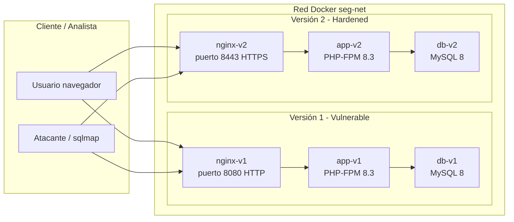

# Arquitectura del laboratorio

## Diagrama general

## Descripción funcional

- `app-v1-vulnerable` es una versión deliberadamente insegura diseñada para ilustrar vulnerabilidades OWASP Top 10.
- `app-v2-hardened` conserva las mismas rutas y función de negocio, pero con protección contra inyección SQL, RCE, XSS, IDOR y cargas de archivos inseguras.
- `nginx-v1` expone el servicio vulnerable en HTTP `8080`.
- `nginx-v2` expone el servicio reforzado en HTTPS `8443` usando un certificado TLS autofirmado.
- Cada aplicación usa su propia base de datos MySQL aislada (`db-v1` y `db-v2`).
- La red Docker `seg-net` simula un entorno de laboratorio controlado con comunicación interna entre contenedores.

## OWASP Top 10 cubiertos

- A01:2021 - Broken Access Control: perfiles accesibles sin autorización en v1.
- A03:2021 - Security Misconfiguration: depuración activa y configuración insegura en v1.
- A01:2021 - Broken Authentication / A03:2021: login vulnerable con SQLi en v1.
- A05:2021 - Security Misconfiguration: HTTP sin TLS en v1, HTTPS en v2.
- A06:2021 - Vulnerable and Outdated Components: uso intencional de código inseguro para demostración.
- A07:2021 - Identification and Authentication Failures: contraseñas débiles y almacenamiento inseguro en v1.
- A08:2021 - Software and Data Integrity Failures: ejecución de comandos con shell_exec en v1.
- A03:2021 - Injection: SQL Injection en login/registro de v1.
- A03:2021 - Injection: Command Injection en el ping de v1.
- A02:2021 - Cryptographic Failures: falta de HTTPS en v1.
- A05:2021 - Security Misconfiguration / A01:2021: XSS almacenado en comentarios de v1.

## Tecnologías usadas

| Componente | Tecnología | Versión |
|---|---|---:|
| Runtime PHP | PHP-FPM | 8.3 |
| Framework | Laravel | 11 |
| Web server | Nginx | Alpine / latest |
| Base de datos | MySQL | 8.0 |
| Orquestación | Docker Compose | 3.8 |
| Certificados TLS | OpenSSL | 3.x |
| Pentesting | sqlmap | 1.7+ |

## Archivos clave

- `docker-compose.yml` — orquesta `app-v1`, `app-v2`, `db-v1`, `db-v2`, `nginx-v1` y `nginx-v2`.
- `nginx/nginx-v2.conf` — habilita HTTPS y usa el certificado de `certs/`.
- `app-v1-vulnerable/app/Http/Controllers/LoginController.php` — inyección SQL deliberada.
- `app-v1-vulnerable/app/Http/Controllers/NetworkController.php` — RCE vulnerable con shell_exec.
- `app-v1-vulnerable/resources/views/comments/index.blade.php` — XSS almacenado con `{!! $comment->body !!}`.
- `app-v2-hardened/app/Http/Controllers/LoginController.php` — uso de `Auth::attempt()` y `Hash::make()`.
- `app-v2-hardened/app/Http/Controllers/NetworkController.php` — validación de host y `escapeshellarg()`.
- `app-v2-hardened/resources/views/comments/index.blade.php` — escape seguro con `{{ $comment->body }}`.
