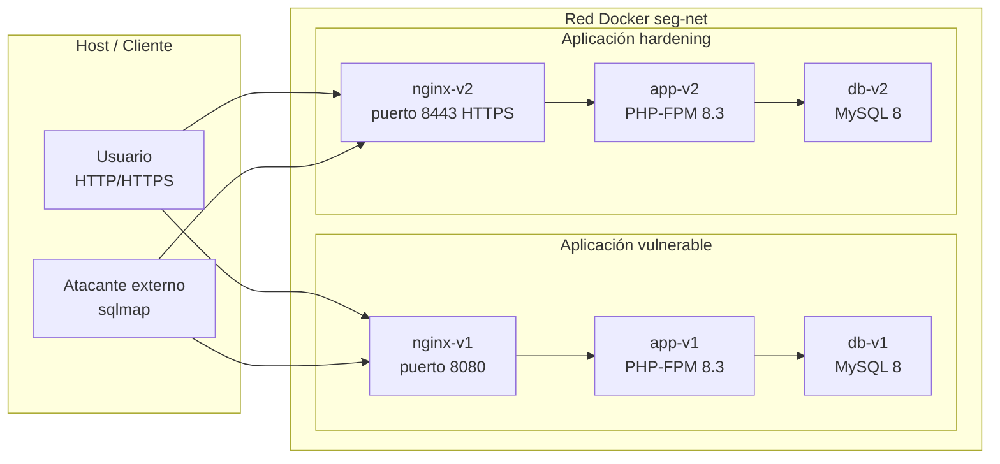

# Arquitectura del laboratorio

## Diagrama general

## Descripción funcional

- v1: exposición HTTP en puerto 8080, con vulnerabilidades intencionales para laboratorio.
- v2: exposición HTTPS en puerto 8443, con las mismas funcionalidades pero corregidas.
- Ambas aplicaciones comparten la misma red Docker llamada seg-net.
- El host atacante externo puede usar herramientas como sqlmap para probar la versión vulnerable.

## Tecnologías usadas

| Componente | Tecnología | Versión |
|---|---|---:|
| Runtime PHP | PHP-FPM | 8.3 |
| Framework | Laravel | 11 |
| Web server | Nginx | Alpine/latest |
| Base de datos | MySQL | 8.0 |
| Orquestación | Docker Compose | 3.8 |
| Certificados TLS | OpenSSL | 3.x |
